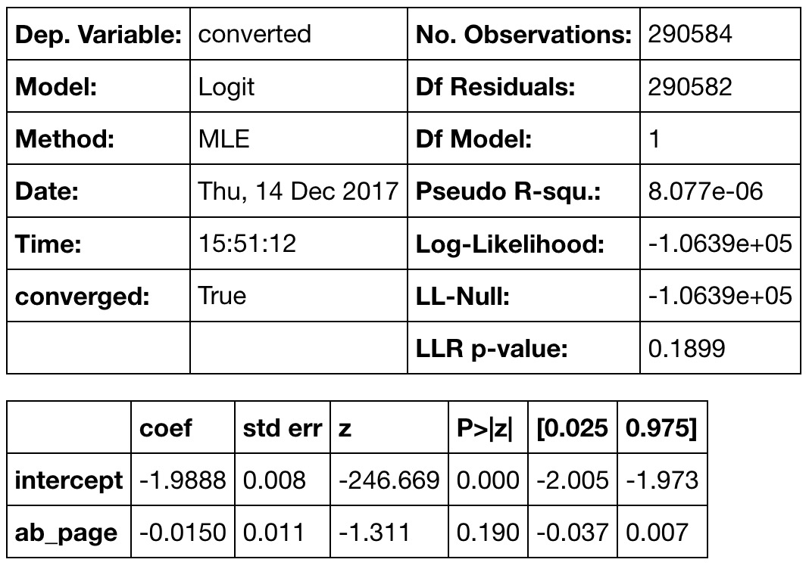
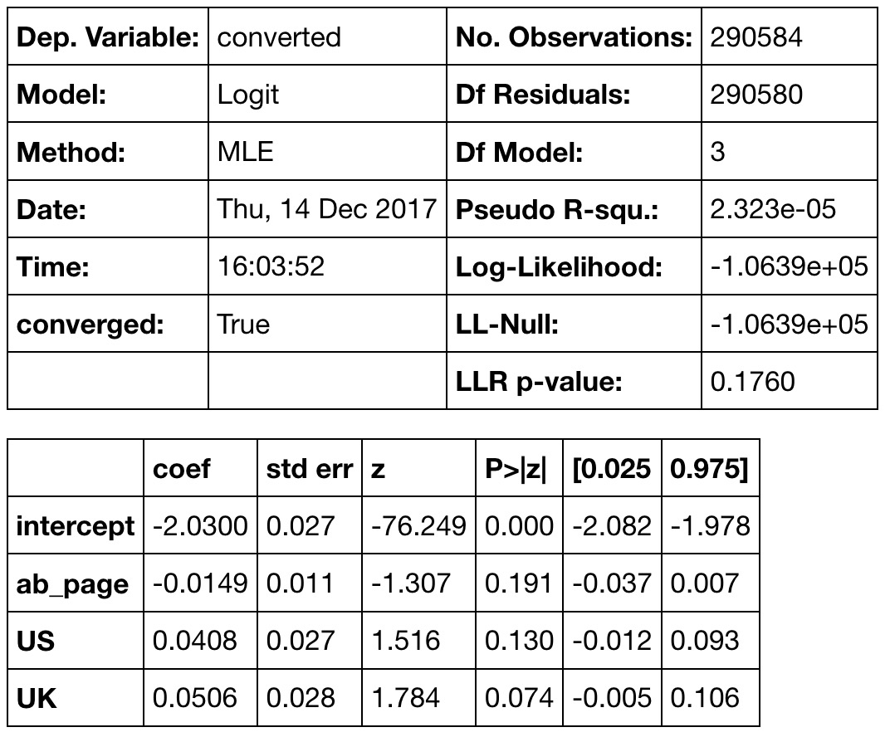

# Data Analyst Nanodegree

## Practical Statistics

## Project: Analyze A/B Test Results

## Table of Contents

1. [Project Overview](#overview)
2. [Probability](#probability)
3. [A/B Test](#abtest)
4. [A Regression Approach](#regression)
5. [Conclusion](#conclusion)
6. [Files](#files)

***

### Project Overview

A/B Tests are very commonly performed by data analysts and data scientists. It is important to get some practice working with the **difficulties** of these.

This is the fourth project of [Data Analyst Nanodegree]() at [Udacity]. For this project, we will be working to understand the results of an **A/B test** run by an e-commerce website **(fictional)**.

My **goal** is to determine whether they should implement this new page, keep the old page, or perhaps run the experiment longer to make their decision.

### Probability

|Event|Probability|
|---|---|
|**Conversion** of an individual regardless of the page he receives|**0.1196**|
|**Conversion** of an individual **given** he was in the **control** group|0.1024|
|**Conversion** of an individual **given** he was in the **treatment** group|**0.1188**|
|Individual received the **new page**|0.5|

Not much change in the conversion based on the layout of the homepage. Instead, the conversion rate falls down from 0.1196 on old page to 0.1188 on new page.

### A/B Test

Notice that because of the time stamp associated with each event, we could technically run a hypothesis test continuously as each observation was observed.

However, then the hard question is do we stop as soon as one page is considered significantly better than another or does it need to happen consistently for a certain amount of time? How long do we run to render a decision that neither page is better than another?

These questions are the difficult parts associated with A/B tests in general.

For now, we are making decision just based on all the data provided. We will assume that the old page is better unless the new page proves to be definitely better at a Type I error rate of 5%.

Accordingly, our null and alternative hypothesis are:

Null Hypothesis (H0): pnew = pold

Alternative Hypothesis (H1): pnew > pold

where,
pold and pnew are conversion rates for old and new pages.

p-value for our alternative hypothesis is 0.09. It shows that we fail to reject our null hyptothesis in favor of the alternative.

### A Regression Approach

Since each row is either a conversion or no conversion, we perform logistic regression in this case.

The goal is to use statsmodels to fit the regression model to see if there is a significant difference in conversion based on which page a customer receives.

Here is a summary of the model:

The dependent variable is `converted` column which is 1 if the user is converted and 0 if not.

Independent variable is `ab_page` column which is 1 for treatment and 0 for control.

The p-value associated with `ab_page` is 0.190. It is different from the p-value calculated in [**Part II**](#abtest) because our null and alternative are differnt now. In **Part II** we were calculating p-value for a one-sided alternative and here we are calculating for a two-side alternative.

Currently, we have only one predictor variable. We obtained an aggregate result based on just the page the user receives. There maybe other factors affecting conversion on a lower level than we are analysing right now. Maybe if we had other features then we could decide better about which page drives more conversion.

Now along with testing if the conversion rate changes for different pages, we also add an effect based on which country a user lives. Countries data is in _countries.csv_.

Here is a summary of the model after considering the location information:

### Conclusion

[Earlier](#alt) we chose our alternative hypothesis that the new page drives more conversion. Then our evaluation of p-value suggested that we cannot reject the null hypothesis.

We then used built-in [z-test](#ztest) to see the statistical significance. The p-value from z-test also suggested that there is not much evidence to reject the null.

[Regression models](#regression) also showed the same results that we cannot reject the null hypothesis. p-values from regression model were also not below 5% **Type I** error rate. Maybe if they run their test for longer time or we have large data compared to this, then the results could be different. But as of now, new page does not increase the conversion rate. In our dataset we had some misalignments in rows that further reduced the area of research.

### Files

- analyse_ab_test_results_notebook.ipynb:

This is the file where I performed the main work of this project including **data wrangling** and **hypothesis testing**.

- ab_data.csv

Input dataset with **five** features:

1. user_id

This is the unique identifier for this data set.

2. timestamp

3. group

Can have two values: *control* or *treatment*. *Control* means the old user group who are visting sites since a very long time. They generally see the *old landing page*. *Treatment* means the new user group who see the *new landing page*.

4. landing_page

It also has two values: *old_page* & *new_page*. New page is the one which we think may improve web traffic on website.

5. converted

It can be 0 or 1. 1 means the user converted and 0 means the user did not convert.

- countries.csv

Dataset to include the *countries* column as another independent variable.

- report.html

HTML export of Jupyter Notebook.
